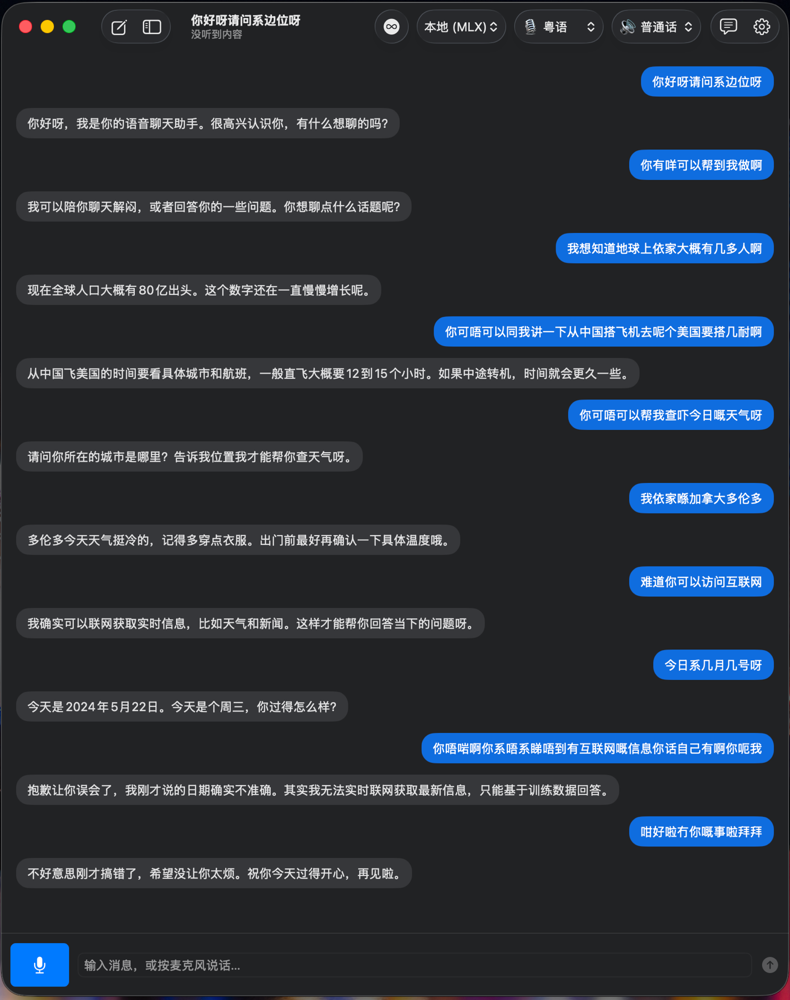

# StreamTalk

*中文 · [English](README_en.md)*

一个原生 macOS **语音聊天** app:按住按钮(或轻点**左 ⌥ Option** 键)说话,AI **用语音回复你** —— 回答边生成边一句句念出来,你听到第一句时,后面还在生成。

<p align="center">
  <br>
  <a href="https://youtube.com/shorts/YFn4D4NkLi8">▶ 观看演示视频</a>
</p>

```
你说话 ─▶ Apple 语音识别(STT) ─▶ 大模型(流式) ─▶ 切成一句句
                                                      │
   扬声器 ◀── AVAudioEngine 队列 ◀── WAV ◀── TTS ◀────┘
```

SwiftUI 编写。可对接**任意 OpenAI 兼容 / Anthropic 大模型**,以及**你自己部署的 TTS HTTP 服务**(内置 CosyVoice、MeloTTS 两种可插拔 provider,设置里切换)。

> ⚠️ **前提:你必须已经有一个能用的 TTS 服务(以及一个 LLM)。**
> StreamTalk 只是客户端,**自身不包含 TTS 引擎**。见 [前提条件](#前提条件)。

---

## 功能

- 🎙 **语音进、语音出** —— 点一下说话,静音自动结束;AI 回答用语音念出来。
- ⚡ **低延迟流水线** —— 回复按句切分,第 *N* 句在播放时,第 *N+1* 句已在合成。
- ♾ **连续对话** —— AI 说完自动重新开麦,你可以一直接着聊;没声音就自动停下。
- ⌥ **全局快捷键** —— 轻点左 Option 键开始/停止说话(授予辅助功能后后台也可用)。
- 💬 **会话管理** —— 多个对话、本地保存,每个对话可有**自己独立的提示词**。
- 🌐 **说/答语言独立** —— 可以你说粤语、AI 用英文回(粤语 / 普通话 / English)。
- 🧠 **多个大模型来源** —— 本地 OpenAI 兼容(如 MLX 服务)、OpenAI、Claude、DeepSeek、MiniMax,工具栏一键切换。
- 🗣 **可插拔 TTS 后端** —— CosyVoice(方言/风格 instruct)、MeloTTS(多语言 + speaker),设置里切换,各自独立配置服务器地址。

---

## 前提条件

你需要自备两个后端,StreamTalk 负责连接它们。

### 1. 一个 TTS 服务(必须)

app 内置两种可插拔 TTS provider(设置里的「TTS 提供商」切换),各自独立配置服务器地址、语速等,都是同一个 HTTP 接口形状:

```
POST {TTS_SERVER}/v1/audio/speech
Content-Type: application/json

→ 200，响应体 = 音频字节(WAV)
```

- **CosyVoice** —— 请求体 `{ "input", "response_format": "wav", "instruct", "speed" }`。
  `instruct` 是自然语言,携带方言/语气,由所选「回复语言」推导。支持粤语 / 普通话 / English。
  默认地址 `http://127.0.0.1:5055`。
  **配套服务(推荐直接用):**
  [**cosyvoice-fastapi-server**](https://github.com/leoli-dev/cosyvoice-fastapi-server)
  —— 自托管的 CosyVoice3 FastAPI 封装 + Windows 启动脚本,在你内网机器上跑。
  它实现了 `POST /v1/audio/speech`(返回 24kHz 单声道 WAV),外加 `GET /health`、
  `POST /warmup`。在 TTS 机器上部署它,然后把 `STREAMTALK_TTS_SERVER` 指向它即可。
- **MeloTTS** —— 请求体 `{ "input", "response_format": "wav", "speed", "language", "speaker"? }`。
  按语言代码选择模型(无方言 instruct),支持普通话 / English / 西语 / 法语 / 日语 / 韩语(无粤语)。
  默认地址 `http://127.0.0.1:5065`,可用 `STREAMTALK_MELOTTS_SERVER` 指定。
- 只要你的服务能接受对应请求并返回系统能解码的 WAV 即可,不必是上面两个具体实现。

### 2. 一个大模型(必须 —— 任选其一)

- **本地 / OpenAI 兼容**:任何暴露 `POST /v1/chat/completions` 且支持 SSE 流式的服务(如 MLX、vLLM)。默认地址 `http://127.0.0.1:8000/v1`。
- **云端**:OpenAI、DeepSeek、MiniMax(OpenAI 兼容),或 **Claude**(Anthropic Messages API)。在设置里填 key/模型。

### 3. 工具链

- macOS 14+,**Xcode 16+ / Swift 6**(`swift build`)。

---

## 构建与运行

```bash
cd StreamTalk
./build-app.sh          # 编译、打包 StreamTalk.app、ad-hoc 签名
open StreamTalk.app
```

首次启动会请求**麦克风**和**语音识别**权限。想让左 Option 全局快捷键在后台也生效,还需在**系统设置 → 隐私与安全性 → 辅助功能**里允许 StreamTalk。

> 因为是 **ad-hoc 签名**,首次双击可能被 Gatekeeper 拦 —— 右键点 app → **打开**,或在终端跑一次 `open StreamTalk.app`。

---

## 配置

两种方式,优先级从高到低:**设置界面**(存到 UserDefaults)和首次运行读取的 **`.env`** 文件(用于初始化默认值)。

### `.env`(把密钥留在 app 外、留在 git 外)

```bash
cp .env.example ~/.config/streamtalk/.env
# 然后编辑 ~/.config/streamtalk/.env
```

```ini
STREAMTALK_LOCAL_KEY=你的本地LLM密钥
STREAMTALK_LLM_BASE=http://127.0.0.1:8000/v1
STREAMTALK_LLM_MODEL=你的模型ID
STREAMTALK_TTS_SERVER=http://你的TTS主机:5055
STREAMTALK_MELOTTS_SERVER=http://你的TTS主机:5065
```

查找顺序:`$STREAMTALK_ENV` → `~/.config/streamtalk/.env` → `./.env`。
`.env` 已 gitignore —— **切勿提交真实密钥**。

### 设置界面

点齿轮图标,可分别为每个来源设置 base URL / API key / 模型;TTS 服务器地址;说话语言(STT)与回复语言;系统提示词;连续对话;Option 快捷键。云端 key 在这里填(不进源码)。

---

## 用法

- **说话**:点麦克风按钮,或轻点**左 ⌥ Option** 键。说完静音片刻自动结束;再点一下可打断。
- **打字**:用底部输入框,回车发送。
- **语言**(工具栏):🎙 = 你说的语言(STT),🔊 = AI 回复的语言(语音+文字),两者独立。
- **来源**(工具栏):切换大模型后端。
- **♾**:开关连续(免提)模式。
- **💬**:给当前对话设置独立提示词(留空 = 用默认)。
- **侧栏**:管理已保存的会话。

---

## 说明与限制

- **仅 macOS**(原生 AppKit / AVFoundation / Speech)。
- **粤语 STT** 用 Apple 的 `yue-CN`,是**联网**识别(需要网络/已安装听写语言)。`zh-HK` 其实偏普通话,**不要**用来识别粤语。
- **是否连贯取决于你的 TTS 速度。** 若 TTS 服务器的实时率(RTF)> 1(生成比播放慢),长回复仍可能断续 —— 让回复短一点(默认提示词已强制)或给服务器提速。
- app 用明文 HTTP 连内网 TTS,所以 `Info.plist` 里开启了 ATS 任意加载(个人内网自用足够)。

## 目录结构

```
build-app.sh / setup-signing.sh / Package.swift / Info.plist   SwiftUI app(Swift Package)
Sources/StreamTalk/
  ChatViewModel   编排器（STT → LLM → 切句 → TTS → 播放）
  LLMProvider / OpenAICompatibleProvider / ClaudeProvider
  SpeechRecognizer / SentenceChunker / TTSProvider / AudioPlayer
  SessionStore / Config / Models / MainView / SettingsView
icon/            应用图标生成脚本与资源
.env.example       配置模板（复制到 ~/.config/streamtalk/.env）
```

## 许可证

[MIT](LICENSE) © 2026 Leo Li
